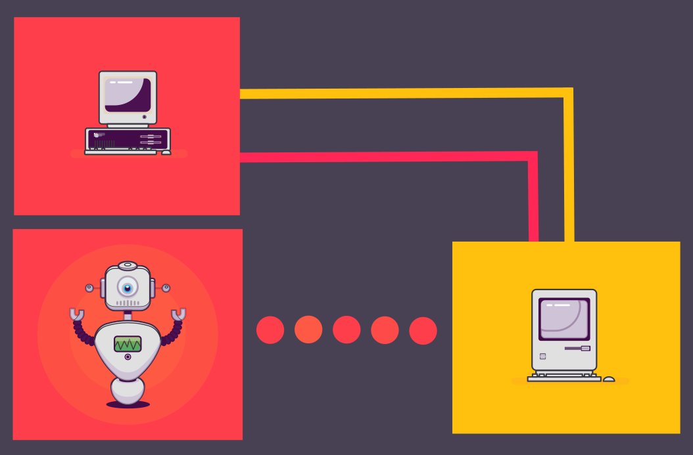

.. meta::
   :keywords: ftp, api, networks, protocols

FTP vs. API – differences in terms of data transmission
-------------------------------------------------------

Users can choose either to send their data to an FTP server or via an API. These two connectivity options have different implications in terms of security, access possibilities, and customer experience.

FTP – an old, well-established protocol
---------------------------------------

FTP (*File Transfer Protocol*) uses a client/server model to allow users to move files between a local machine (*client*) and a remote host (*server*). FTP is an easy and convenient method to download and upload large data volumes.

One particular aspect of FTP is that it relies on "two" logical TCP connections to ensure communication between the client and the server: 

* **Control connection:** This primary communication channel ensures the transmission of control traffic over port 21 and remains active during the entire FTP session. Control traffic includes FTP commands and replies. 

* **Data connection:** Whenever you need to transfer files between a client and a remote server or vice versa, FTP will initiate this TCP connection to ensure data transmission over port 20. Unlike the control connection, a data connection does not remain active during the entire FTP session and ends immediately after the file transfer.

FTP uses a simple authentication mechanism that consists in using a "user name" and a "password". The client sends the authentication data to the remote server using the FTP commands: ``USER`` and ``PASS``.

The following table illustrates the three main categories of FTP commands according to the FTP standard:

.. role::  raw-html(raw)
    :format: html

.. list-table::
   :widths: 50
   :class: tight-table
   
   * - **Access Control Commands**
   * - ``USER`` :raw-html:`&rarr;` *User Name*, ``PASS`` :raw-html:`&rarr;` *Password*, ``ACCT`` :raw-html:`&rarr;` *Account*, ``CWD`` :raw-html:`&rarr;` *Change Working Directory*, ``CDUP`` :raw-html:`&rarr;` *Change Directory Up*, ``SMNT`` :raw-html:`&rarr;` *Structure Mount*, ``REIN`` :raw-html:`&rarr;` *Reinitialize*, ``QUIT`` :raw-html:`&rarr;` *Logout*
   * - **Transfer Parameter Commands**
   * - ``PORT`` :raw-html:`&rarr;` *Data Port*, ``PASV`` :raw-html:`&rarr;` *Passive*, ``TYPE`` :raw-html:`&rarr;` *Representation Type*, ``STRU`` :raw-html:`&rarr;` *File Structure*, ``MODE`` :raw-html:`&rarr;` *Transfer Mode*
   * - **FTP Service Commands**
   * - ``RETR`` :raw-html:`&rarr;` *Retrieve*, ``STOR`` :raw-html:`&rarr;` *Store*, ``STOU`` :raw-html:`&rarr;` *Store Unique*, ``APPE`` :raw-html:`&rarr;` *Append*, ``ALLO`` :raw-html:`&rarr;` *Allocate*, ``REST`` :raw-html:`&rarr;` *Restart*, ``RNFR`` :raw-html:`&rarr;` *Rename From*, ``RNTO`` :raw-html:`&rarr;` *Rename To*, ``ABOR`` :raw-html:`&rarr;` *Abort*, ``DELE`` :raw-html:`&rarr;` *Delete*, ``RMD`` :raw-html:`&rarr;` *Remove Directory*, ``MKD`` :raw-html:`&rarr;` *Make Directory*, ``PWD`` :raw-html:`&rarr;` *Print Working Directory*, ``LIST`` :raw-html:`&rarr;` *List*, ``NLST`` :raw-html:`&rarr;` *Name List*, ``SITE`` :raw-html:`&rarr;` *Site Parameters*, ``SYST`` :raw-html:`&rarr;` *System*, ``STAT`` :raw-html:`&rarr;` *Status*, ``HELP`` :raw-html:`&rarr;` *Help*, ``NOOP`` :raw-html:`&rarr;` *Noop*

The FTP specification `RFC959 <https://www.w3.org/Protocols/rfc959/4_FileTransfer.html>`_ provides a detailed description for each of the above illustrated commands. 

FTP and security
----------------

Data transmission with the basic FTP protocol is insecure because it is unencrypted. For a secure data transfer, you need to use FTPS (*FTP over SSL*) or SFTP (*SSH File Transfer Protocol*). Unlike FTPS, which requires opening multiple ports for data transmission, SFTP only needs a single port number to transfer the data. Therefore, SFTP is more suitable for firewall security. 

While FTP is convenient for large data transfers, its performance in terms of access possibilities and customer experience remains rather limited. For instance, FTP does not allow you to share resources in real-time between multiple systems, nor does it give you the ability to process data on remote systems.

API – more access options for a better customer experience
----------------------------------------------------------

An API (*Application Programming Interface*) is an interface that serves as a bridge between two or more applications. The server-side components encapsulate the business logic and make it available to multiple clients through the API. To ensure a secure data transmission, companies can use the HTTPS protocol in conjunction with different encryption methods. 

Besides providing real-time data access to the linked systems, an API integration allows clients to manage and process data by sending requests to the appropriate endpoints. APIs offer more advantages over FTP, but they require a higher investment of time and technical expertise.