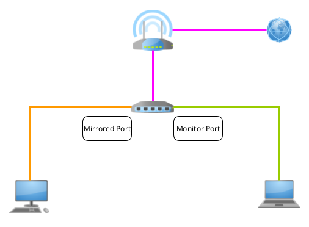

.. meta::
   :description: MTU and Connectivity - resolving connectivity issues by adjusting the MTU size
   :keywords: maximum transmission unit, MTU, TCP/IP, fragmentation, IP datagram, connectivity

MTU Size and Connectivity Issues
--------------------------------

.. figure:: mtu-connectivity.png
   :alt: MTU and Connectivity
   :scale: 75%
   :align: center

   Picture by kreatikar `(pixabay.com) <https://pixabay.com>`_

Factors impacting network connectivity
======================================

Making changes to your network configuration can sometimes result in connection inconsistencies, such as a partial or complete loss of connectivity. The reasons for such incidents are multiple and range from DNS misconfiguration to inappropriate firewall rules or hardware failures, among other things. 

One additional aspect that you should consider when some sites become unreachable after changing the network configuration is the MTU size. MTU stands for ``Maximum Transmission Unit`` and is a concept that relates to the `OSI reference model <https://www.redhat.com/sysadmin/osi-model-bean-dip>`_, `IP datagram size <https://www.linuxjunkies.org/network/tcpip/general-description-of-the-tcp-ip-protocols/>`_ and `IP fragmentation <https://packetpushers.net/ip-fragmentation-in-detail/>`_.

Analyzing network traffic
-------------------------

If you have a `managed switch <https://www.cisco.com/c/en/us/products/switches/what-is-a-managed-switch.html>`_ and face connectivity issues after altering your network configuration, a recommended method to capture and analyze your traffic would be to use port mirroring in combination with packet/network analyzers such as `tcpdump <https://www.linuxjournal.com/content/tcpdump-fu>`_ and `wireshark <https://www.linuxjournal.com/content/tcp-analysis-wireshark>`_. 

Port mirroring is a technique that allows you to forward a copy of all inbound and outbound packets from a single port or an entire VLAN to a target port for diagnostic purposes. You can hence configure a ``mirrored port`` for the traffic to be mirrored, and a ``monitor port`` for your local traffic destination. 

   A simple network configuration for port mirroring 

Find out the MTU of your Ethernet interface
-------------------------------------------

In this particular case, it turned out that a connection timeout occured each time the client was trying to establish a connection with the destination server. This can happen when a gateway along the connection path is using an MTU smaller than the one we are using, and the IPv4 datagram is not allowed to be fragmented (``DF flag`` set to "1"). 

   MTU difference along the transmission path

An IPv4 datagram consists of two parts: a ``header`` and a ``payload``. The header contains fields that are essential for data transmission, while the payload encloses the actual data. The default MTU size for Ethernet is 1500 bytes.

On Linux machines, you can check the MTU size of your ethernet interface through the following command:

.. code-block:: console
   
   $ ip a | grep mtu

.. note::

   The ``ip a`` command also allows you to list all the available interfaces on your machine with their corresponding IPs. 

Change the MTU size permanently
-------------------------------

Fot the purpose of this guide, we are going to assume that the name of your ethernet interface is ``eth0``. Use the ``ip a`` command to check the actual name of your ethernet interface.

To change the MTU size on Debian based distros, run the following command:     

.. code-block:: console

   $ sudo nano /etc/network/interfaces

Then set a lower MTU value (e.g. 1464) for the required interface by adding a corresponding line at the bottom:

.. code-block:: console

   $ mtu 1464

Save and close the file, then restart the networking services by running the following command:

.. code-block:: console

   $ sudo service networking restart

To change the MTU size on Red Hat based distros, run the following command:     

.. code-block:: console

   $ sudo nano /etc/sysconfig/network-scripts/ifcfg-eth0

Then set a lower MTU value (e.g. 1464) for the required interface by adding a corresponding line at the bottom:

.. code-block:: console

   $ MTU="1464"

Save and close the file, then restart the networking services by running the following command:

.. code-block:: console

   $ sudo service networking restart

.. note::

   The minimum allowed value for IPv6 is 1280. Moreover, IPv6 handles fragmentation in a completely different way to that of IPv4. For further information about the differences, check the article about `IP fragmentation <https://packetpushers.net/ip-fragmentation-in-detail/>`_. 

.. |reg| unicode:: U+000AE .. REGISTERED SIGN